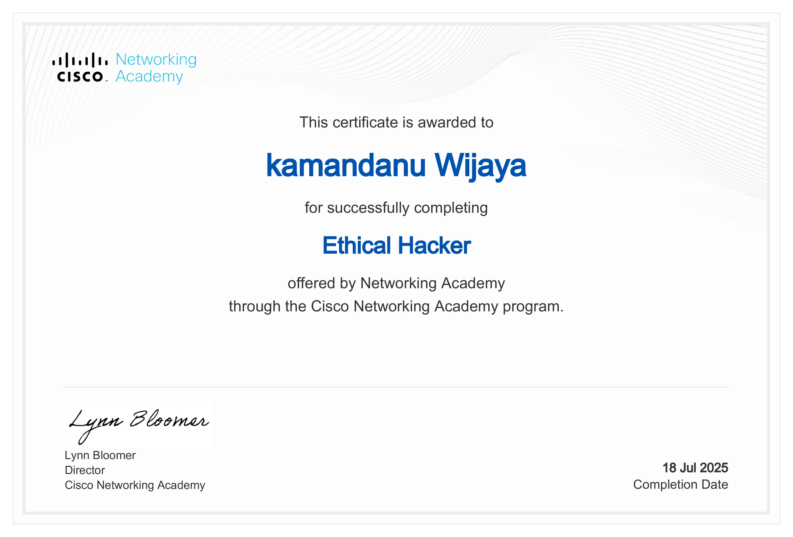
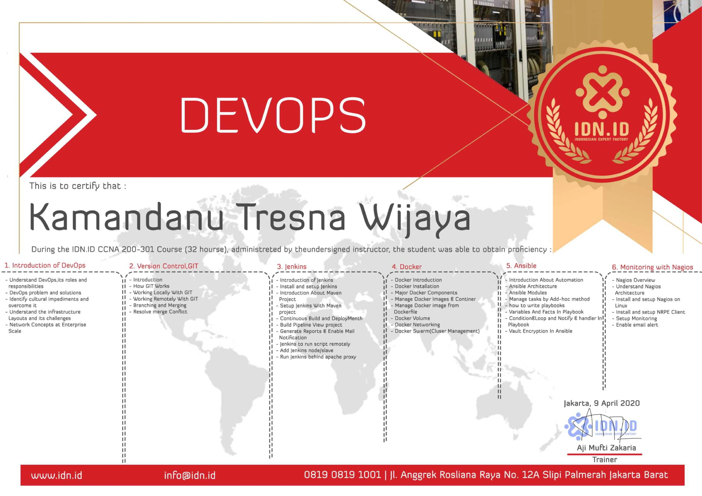
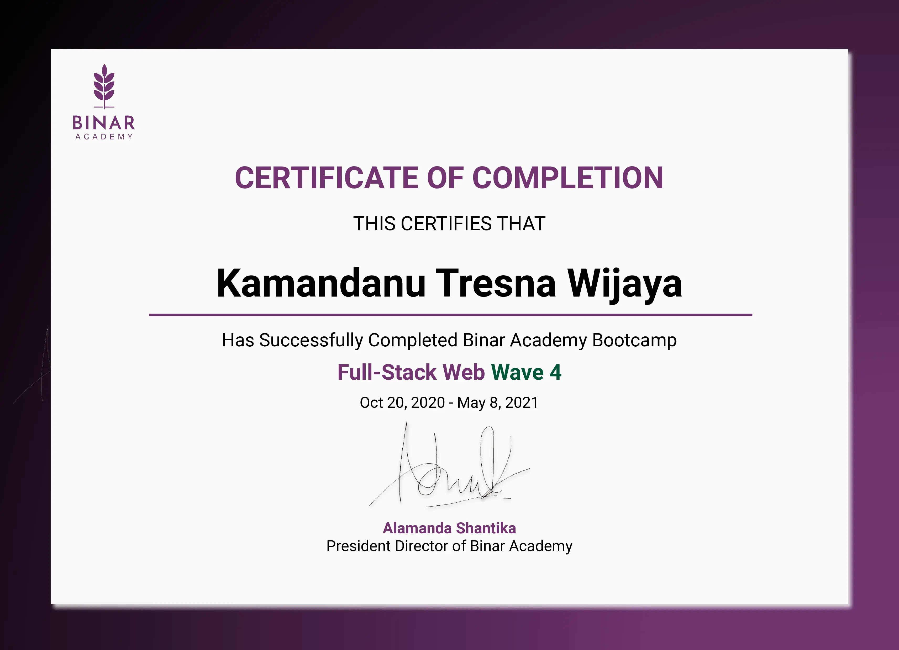

# Kamandanu Tresna Wijaya
**IT Infrastructure & Network Administrator**  
*(Official Title: IT Support)*  
Indonesia | Open to work & project

## Contact

- **Email**: [kamandanu.wijaya@gmail.com](mailto:kamandanu.wijaya@gmail.com)  
- **Phone**: +62 812 2233 129 *(WhatsApp available)*

---

## Professional Summary

IT Infrastructure & Network Administrator with 15 years of hands-on experience supporting and managing enterprise IT environments. Although officially titled as IT Support, my role covers full responsibility for server administration, network infrastructure, system availability, and enterprise IT operations. Experienced in maintaining stable and secure systems, leading infrastructure changes, and resolving complex technical issues in business-critical environments. Strong communicator with the ability to work effectively across technical and non-technical teams.

---

## Professional Experience

### IT Support (Infrastructure & Network Administration)  
**PT Geoservices** — Full-time  
*July 2022 – Present | Bekasi, Indonesia*

- Manage and maintain enterprise IT infrastructure, including servers, network devices, firewalls, NAS, CCTV, and PABX systems.
- Ensure high system availability through proactive monitoring, structured maintenance, and automated backup strategies.
- Act as the primary escalation point for infrastructure and network-related incidents.
- Troubleshoot and resolve complex server, network, and system issues, reducing recurring incidents through preventive solutions.
- Perform infrastructure changes, integrations, and improvements with careful planning to avoid business disruption.
- Execute end-to-end office IT operations and transitions, ensuring continuity of services throughout the process.
- Develop and maintain internal technical documentation and knowledge base to improve operational efficiency and response time.

---

### IT Support (Infrastructure & Network Administration)  
**PT Bahtera Niaga Internasional** — Full-time  
*June 2011 – July 2022 | Jakarta, Indonesia*

- Supported and maintained enterprise IT systems and network infrastructure across multiple office environments.
- Installed, configured, and managed Windows and Linux servers and LAN/WAN networks.
- Implemented monitoring, maintenance, and backup procedures to improve system stability and reliability.
- Reduced issue resolution time through structured troubleshooting workflows and clear escalation paths.
- Provided first-line and infrastructure-level technical support for internal users and management.
- Designed, developed, and maintained the corporate website to support company visibility and communication.
- Deployed and managed CCTV and PABX systems to enhance office security and internal communication.

---

## Education

**SMK Toga Terang 2**  
High School Diploma — Teknik Mesin Otomotif  
*2000 – 2003*

---

## Core Skills

### Infrastructure & Systems
- Windows Server, Linux Server  
- Active Directory, DNS, Web & Mail Server  
- Server Administration  
- Virtualization (Proxmox, VM Ware, OS Boxes)  
- Virtual Private Servers (VPS)  
- Network-Attached Storage (NAS)  
- Backup & Recovery Systems  
- Cloud Infrastructure Fundamentals (AWS, GCP)

### Networking & Security
- MikroTik Routing & Firewall  
- Routing & Switching  
- Network Security  
- Monitoring & Troubleshooting  
- Network Topology Design  

### Automation & Monitoring
- Docker, Git  
- Terraform, Ansible  
- Nagios, Zabbix  

### Basic Development & Web
- HTML, CSS, JavaScript, Python  
- Node.js, Express.js, Django, React.js  
- MySQL, REST API, MVC Architecture  

### Other
- CCTV (Analog & Digital), PABX, VSAT  
- IT Operations & End-User Support  
- Technical Documentation  

---

## Additional Information

### Professional Interests
- Cybersecurity  
- Cloud Infrastructure  
- DevOps Tools & Automation  

### Work Preferences
- Open to IT Infrastructure, System Administration, Network Engineering, and Infrastructure-focused IT Support roles  
- Comfortable working with global and cross-functional teams  

---

## Certifications

Selected certifications relevant to infrastructure, security, and automation.

### Infrastructure & Security

- **Google IT Support** — Google / Coursera  
  

  
View certificate

  

  

- **Ethical Hacker** — Cisco Networking Academy  
  

  
View certificate

  

  

- **Introduction to Cybersecurity** — Cisco Networking Academy  
  

  
View certificate

  

  

### Cloud, Automation & DevOps

- **AWS Cloud Practitioner Essentials** — Dicoding  
  

  
View certificate

  

  

- **DevOps** — ID-Networkers  
  

  
View certificate

  

  

### Basic Web Development & Programming

- **Fullstack Web Development** — Binar Academy 
  

  
View certificate

  

  

- **Python Fullstack Web Development** — Code Artisan Academy 
  

  
View certificate

  

  

---

<a href="/cv/wijaya-cv.pdf" download>
  ⬇ Download CV (PDF)
</a>

